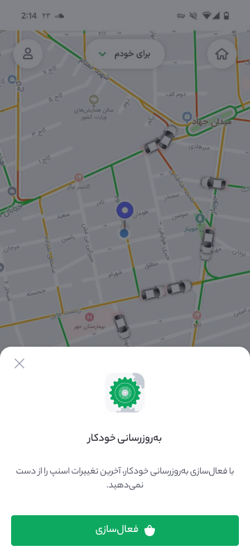

# BazaarUpdater Android SDK

<p align="center">

</p>

[](https://www.apache.org/licenses/LICENSE-2.0)
[](https://jitpack.io/#cafebazaar/BazaarUpdater)


BazaarUpdater is an Android library that simplifies checking for updates and managing the update process for your application on Bazaar.

## Setup

To get started with BazaarUpdater, you need to add the JitPack repository to your project and include the library dependency.

### Adding JitPack Repository

**Kotlin DSL**

```kotlin
repositories {
    maven { url = uri("https://jitpack.io") }
}
```

**groovy**
```groovy
repositories {
    maven { url 'https://jitpack.io' }
}
```

## Adding Dependency

**Kotlin DSL**

```kotlin
dependencies {
    implementation("com.github.cafebazaar:bazaarUpdater:1.0.0-beta3")
}
```

**groovy**

```groovy
dependencies {
    implementation 'com.github.cafebazaar:bazaarUpdater:1.0.0-beta3'
}
```
## Usage

### Checking for Updates

To check if there are any updates available for your application on Bazaar, use the following code:


```kotlin
BazaarUpdater.getLastUpdateState(context = context) { result ->
    when(result) {
        UpdateResult.AlreadyUpdated -> {
            // Handle the case where the app is already updated
        }
        is UpdateResult.Error -> {
            // Handle the error case
            val errorMessage = result.getError()?.message
        }
        is UpdateResult.NeedUpdate -> {
            // Handle the case where an update is needed
            val targetVersion = result.getTargetVersionCode()
        }
    }
}
```

<details><summary><b>Java Usage</b></summary>

```java
BazaarUpdater.getLastUpdateState(context, result -> {
    if (result.isAlreadyUpdated()) {
        // Handle the case where the app is already updated
    } else if (result.isUpdateNeeded()) {
        // Handle the case where an update is needed
        long targetVersion = result.getTargetVersionCode();
    } else {
        // Handle the error case
        String errorMessage = result.getError().getMessage();
    }
});
```
</details>

#### Update Result States

##### 1. AlreadyUpdated: Indicates that your application is up-to-date.

##### 2. Error: Indicates an error occurred. Use `result.message` to get the error message.

##### 3. NeedUpdate: Indicates that a new update is available. Use `result.getTargetVersionCode()` to get the version code of the update.

### Updating the Application

To update your application when a new version is available on Bazaar, simply call:

```kotlin
BazaarUpdater.updateApplication(context = context)
```

## Coming soon 🔥
<p align="center">

</p>

## Contributing
Contributions are welcome! If you have suggestions or improvements, please open an issue or submit a pull request


## License

This project is licensed under the Apache License 2.0 - see the [LICENSE](LICENSE) file for details.

<br/>
<br/>

<p align="center">
Made with 💚 in Bazaar Hackathon 1403
</p>


