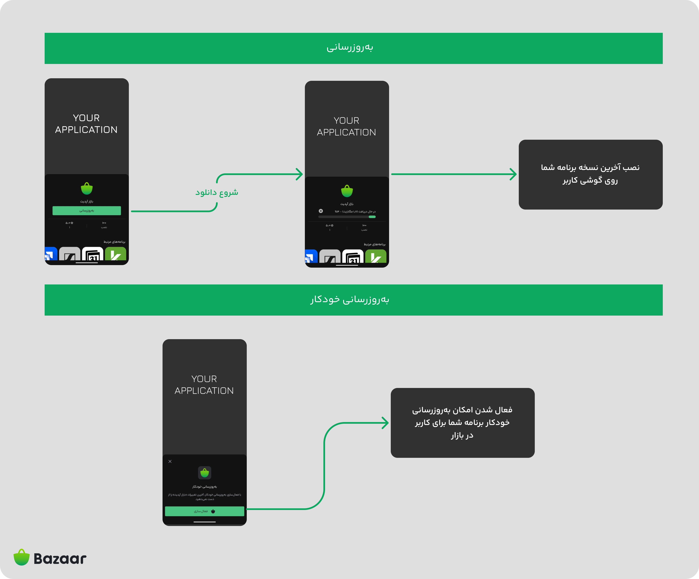

# BazaarUpdater Android SDK

<p align="center">

</p>

[](https://www.apache.org/licenses/LICENSE-2.0)
[](https://jitpack.io/#cafebazaar/BazaarUpdater)


BazaarUpdater is an Android library that simplifies checking for updates and managing the update process for your application on Bazaar.

## Setup

To get started with BazaarUpdater, you need to add the JitPack repository to your project and include the library dependency.

### Adding JitPack Repository

**Kotlin DSL**

```kotlin
repositories {
    maven { url = uri("https://jitpack.io") }
}
```

**groovy**
```groovy
repositories {
    maven { url 'https://jitpack.io' }
}
```

## Adding Dependency

**Kotlin DSL**

```kotlin
dependencies {
    implementation("com.github.cafebazaar:bazaarUpdater:1.1.0")
}
```

**groovy**

```groovy
dependencies {
    implementation 'com.github.cafebazaar:bazaarUpdater:1.1.0'
}
```
## Usage

### Checking for Updates

To check if there are any updates available for your application on Bazaar, use the following code:


```kotlin
BazaarUpdater.getLastUpdateState(context = context) { result ->
    when(result) {
        UpdateResult.AlreadyUpdated -> {
            // Handle the case where the app is already updated
        }
        is UpdateResult.Error -> {
            // Handle the error case
            val errorMessage = result.getError()?.message
        }
        is UpdateResult.NeedUpdate -> {
            // Handle the case where an update is needed
            val targetVersion = result.getTargetVersionCode()
        }
    }
}
```

<details><summary><b>Java Usage</b></summary>

```java
BazaarUpdater.getLastUpdateState(context, result -> {
    if (result.isAlreadyUpdated()) {
        // Handle the case where the app is already updated
    } else if (result.isUpdateNeeded()) {
        // Handle the case where an update is needed
        long targetVersion = result.getTargetVersionCode();
    } else {
        // Handle the error case
        String errorMessage = result.getError().getMessage();
    }
});
```
</details>

#### Update Result States

##### 1. AlreadyUpdated: Indicates that your application is up-to-date.

##### 2. Error: Indicates an error occurred. Use `result.message` to get the error message.

##### 3. NeedUpdate: Indicates that a new update is available. Use `result.getTargetVersionCode()` to get the version code of the update.

### Updating the Application

To update your application when a new version is available on Bazaar, simply call:

```kotlin
BazaarUpdater.updateApplication(context = context)
```
## Auto Update

This feature allows you to enable automatic updates for your apps in Bazaar. Once enabled, Bazaar will check for application updates daily. If an update is available and Bazaar is the update owner of your app, it will automatically download and install the update.

> ⚠️ Note: This feature requires Bazaar version 26.2.0 or higher.

> ⚠️ Package Name : Ensure the package name (also known as the application ID in Android) in your source code exactly matches the one used in the already published app. This is typically defined in your app's AndroidManifest.xml file.

> ⚠️ Signature : The app must be signed with the same key as the published version. Make sure you’re using the correct keystore and alias that were used for the original app.

### Checking for Auto Update

To check whether Auto Update is enabled for your application in Bazaar, use the following code:

```kotlin
BazaarAutoUpdater.getLastAutoUpdateState(context = this) { result ->
    when (result) {
        is AutoUpdateResult.Error -> {
            // Handle the error case
            val errorMessage = result.getError()?.message
        }
        is AutoUpdateResult.Result -> {
            val isEnabled = result.isEnable()
        }
    }
}
```

<details>
<summary><strong>Java Usage</strong></summary>

```java
BazaarAutoUpdater.getLastAutoUpdateState(context, result -> {
    if (result.getError() != null) {
        // Handle the error case
        String errorMessage = result.getError().getMessage();
    } else {
        Boolean isEnabled = result.isEnable();
    }
});
```

</details>

### Enable Auto Update

To enable Auto Update for your application, simply call the following method:

```kotlin
BazaarAutoUpdater.enableAutoUpdate(context = context)
```

## Contributing

Contributions are welcome! If you have suggestions or improvements, please open an issue or submit a pull request.


## License

This project is licensed under the Apache License 2.0 - see the [LICENSE](LICENSE) file for details.

<br/>
<br/>

<p align="center">
Made with 💚 in Bazaar Hackathon 1403
</p>


